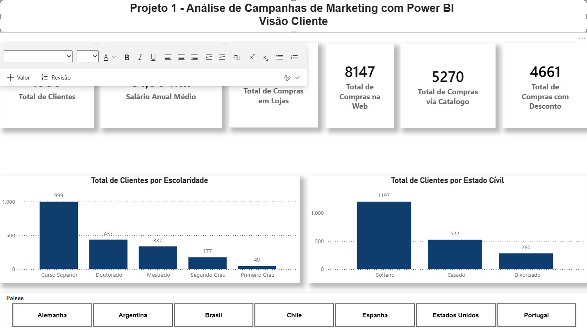
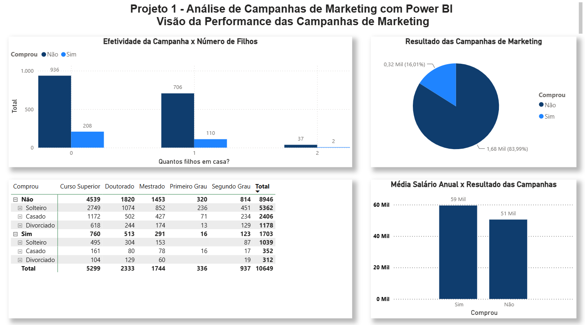
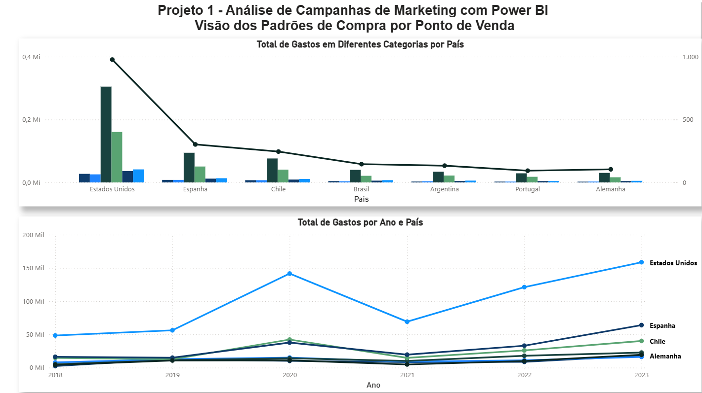
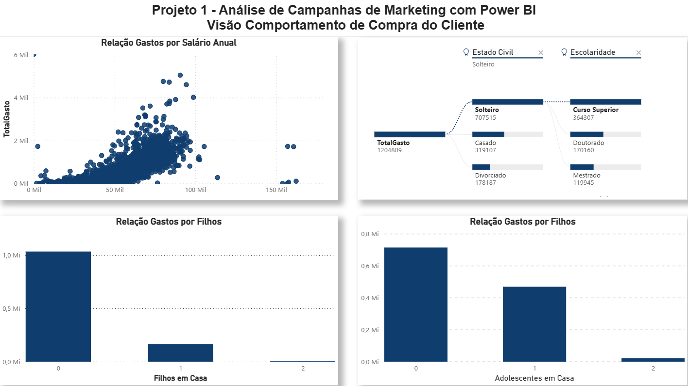

# 📊 Dashboard de Performance de Marketing

## 📖 Sobre o Projeto

Este projeto consiste no desenvolvimento de um dashboard interativo no **Power BI** para análise de desempenho de campanhas de marketing, com o objetivo de transformar dados em informações estratégicas para apoiar a tomada de decisão.

O dashboard foi desenvolvido seguindo as etapas de um projeto de Business Intelligence, desde o tratamento e modelagem dos dados até a criação de indicadores de desempenho (KPIs) e visualizações interativas.

## 🎯 Objetivo

Disponibilizar uma visão consolidada da performance das campanhas de marketing, permitindo identificar oportunidades de melhoria, acompanhar indicadores estratégicos e apoiar decisões baseadas em dados.

## 📊 Indicadores Analisados

* Receita Total
* Investimento em Marketing
* Retorno sobre Investimento (ROI)
* Taxa de Conversão
* Custo por Aquisição (CPA)
* Desempenho por Campanha
* Desempenho por Canal de Marketing
* Evolução dos Resultados ao Longo do Tempo

## 🛠️ Tecnologias Utilizadas

* Power BI
* Power Query
* DAX
* Modelagem de Dados
* Business Intelligence
* Arquivos CSV

## 📂 Dashboards Desenvolvidos

## 💡 Principais Insights

* Identificação das campanhas com maior retorno sobre investimento (ROI).
* Comparação do desempenho entre diferentes canais de marketing.
* Análise da evolução das campanhas ao longo do tempo.
* Monitoramento dos principais indicadores para apoio à tomada de decisão.
* Visualização interativa para facilitar a análise dos resultados.

## 👨‍💻 Autor

**Guilherme Polato**

Analista de Sistemas | Power BI | SQL | Python | Business Intelligence | Análise de Dados

Este projeto faz parte do meu portfólio profissional e demonstra conhecimentos em análise de dados, modelagem de dados e desenvolvimento de dashboards para apoio à tomada de decisão.
